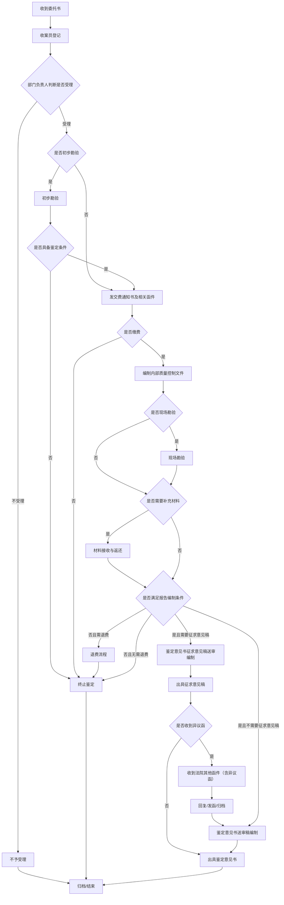
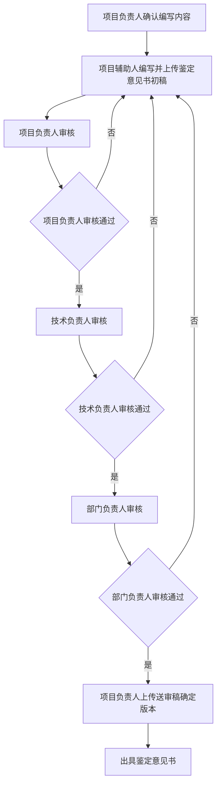

# 司法鉴定流程图文字版

整理日期：2026-06-13

## 1. 对应流程图

本文件由项目内以下流程图和流程说明整理而来：

- `docs/flowcharts/judicial-appraisal-main-flow.png`：司法鉴定主流程图
- `docs/flowcharts/judicial-appraisal-detailed-flow-overview.png`：司法鉴定细化流程总图
- `docs/flowcharts/final-opinion-review-detailed-flow.png`：鉴定意见书送审稿编制细化流程图
- `docs/judicial-appraisal-manual-based-requirements-v2.md`：使用手册范围版流程说明
- `docs/judicial-appraisal-flowchart-baseline.md`：流程图验收基准

## 2. 主流程文字版

```text
收到委托书
  ↓
收案员登记
  ↓
部门负责人审阅并判断是否受理
  ├─ 不受理 → 不予受理 → 归档 → 结束
  └─ 受理 → 项目负责人判断是否初步勘验
          ├─ 需要初步勘验 → 初步勘验
          │       ├─ 具备鉴定条件 → 发交费通知书及相关函件
          │       └─ 不具备鉴定条件 → 终止鉴定 → 归档 → 结束
          └─ 不需要初步勘验 → 发交费通知书及相关函件

发交费通知书及相关函件
  ↓
项目辅助人编制并上传缴费相关函件
  ↓
项目负责人审核
  ├─ 审核不通过 → 退回项目辅助人修改
  └─ 审核通过 → 档案管理员申请盖章 / 用章申请
          ↓
      项目辅助人上传盖章扫描件
          ↓
      项目负责人确认是否缴费
          ├─ 未缴费 → 终止鉴定 → 归档 → 结束
          └─ 已缴费 → 编制内部质量控制文件

编制内部质量控制文件
  ↓
项目辅助人上传质量控制文件
  ↓
项目负责人审核
  ├─ 审核不通过 → 退回项目辅助人修改
  └─ 审核通过 → 判断是否 F 类项目
          ├─ F 类项目 → 部门负责人审核 → 档案管理员盖章 → 项目辅助人上传扫描件
          └─ 非 F 类项目 → 档案管理员盖章 → 项目辅助人上传扫描件
          ↓
      项目负责人判断后续方向
          ├─ 需要现场勘验 → 现场勘验
          ├─ 需要补充材料 → 材料接收与返还
          ├─ 满足报告编制条件且需要征求意见稿 → 鉴定意见书征求意见稿送审编制
          ├─ 满足报告编制条件且不需要征求意见稿 → 鉴定意见书送审稿编制
          ├─ 不满足报告编制条件且需要退费 → 退费流程 → 终止鉴定
          └─ 不满足报告编制条件且无需退费 → 终止鉴定

现场勘验
  ↓
项目辅助人上传现场工作方案
  ↓
根据金额判断审核链路
  ├─ 15 万以下 → 项目负责人审核
  └─ 15 万以上 → 项目负责人审核 → 技术负责人审核 → 部门负责人审核
          ↓
项目辅助人上传设备出入库记录、设备使用记录
  ↓
项目负责人确认后续方向
  ├─ 需要补充材料 → 材料接收与返还
  ├─ 满足报告编制条件且需要征求意见稿 → 鉴定意见书征求意见稿送审编制
  ├─ 满足报告编制条件且不需要征求意见稿 → 鉴定意见书送审稿编制
  ├─ 不满足报告编制条件且需要退费 → 退费流程 → 终止鉴定
  └─ 不满足报告编制条件且无需退费 → 终止鉴定

材料接收与返还
  ↓
项目负责人选择材料来源或补材类型
  ├─ 需要补充材料 → 编制补充鉴定材料通知书 → 发交费通知书及相关函件
  └─ 委托方直接提供 → 指定同事上传材料 → 项目负责人确认
          ↓
      项目辅助人登记材料
          ↓
      判断材料是否需要归还
          ├─ 需要归还 → 填写材料接收及返还登记表 → 材料返还 → 归档
          └─ 无需归还 → 档案管理员保管 → 归档
          ↓
      项目负责人判断报告编制条件
          ├─ 需要征求意见稿 → 鉴定意见书征求意见稿送审编制
          ├─ 不需要征求意见稿 → 鉴定意见书送审稿编制
          ├─ 需要退费 → 退费流程 → 终止鉴定
          └─ 无需退费 → 终止鉴定

鉴定意见书征求意见稿送审编制
  ↓
项目辅助人编制初稿
  ↓
项目负责人审核
  ↓
技术负责人审核
  ↓
部门负责人审核
  ↓
项目负责人上传最终版本送审稿
  ↓
出具征求意见稿
  ↓
项目辅助人编制鉴定说明函
  ↓
项目负责人审核
  ↓
档案管理员盖章 / 用章申请
  ↓
项目辅助人上传盖章扫描件并寄出材料
  ↓
项目负责人等待反馈并判断是否收到异议函
  ├─ 收到异议函 → 收到法院其他函件（含异议函）
  └─ 未收到异议函 → 出具鉴定意见书

鉴定意见书送审稿编制
  ↓
项目辅助人编写并上传鉴定意见书初稿
  ↓
项目负责人审核
  ↓
技术负责人审核
  ↓
部门负责人审核
  ↓
项目负责人上传鉴定意见书送审稿确定版本
  ↓
出具鉴定意见书

出具鉴定意见书
  ↓
项目负责人可修改鉴定意见书
  ↓
项目辅助人上传鉴定人承诺书、司法鉴定复核意见
  ↓
项目负责人审核
  ↓
档案管理员申请盖章和开票
  ↓
用章申请 / 申请开票
  ↓
项目辅助人上传盖章扫描件
  ↓
归档
  ↓
结束
```

## 3. 19 个业务流程摘要

### 3.1 收到委托书

入口：流程中心 -> 新建工作 -> 司法鉴定 -> 收到委托书。

1. 流程发起者填写委托相关信息。
2. 转交收案员登记。
3. 收案员检查后转交部门负责人审阅。
4. 部门负责人确认是否受理，并指定项目负责人。
5. 项目负责人确认是否进行初步勘验，并指定项目辅助人。

分支：

- 不受理：进入“不予受理”。
- 受理且需要初步勘验：进入“初步勘验”。
- 受理且不需要初步勘验：进入“发交费通知书及相关函件”。
- 可并行通知项目辅助人、收案员材料接收等相关任务。

### 3.2 初步勘验

来源：收到委托书。

1. 项目负责人确认初步勘验时间、人员。
2. 项目负责人询问委托人是否参加初步勘验。
3. 项目负责人通知鉴定当事人初步勘验时间。
4. 项目负责人上传现场工作方案。
5. 项目辅助人作勘验准备。
6. 项目辅助人上传仪器设备库出入表、仪器设备使用记录。
7. 项目负责人审核材料。
8. 项目负责人判断是否具备鉴定条件。

分支：

- 具备鉴定条件：进入“发交费通知书及相关函件”。
- 不具备鉴定条件：进入“终止鉴定”。
- 材料不符合要求：退回项目辅助人补充。

### 3.3 发交费通知书及相关函件

来源：收到委托书、初步勘验、材料接收与返还、收到出庭通知等。

1. 项目负责人接收流程。
2. 基础信息从父流程同步。
3. 项目负责人转交项目辅助人。
4. 项目辅助人上传缴费通知书及相关函件。
5. 项目负责人审核。
6. 档案管理员确认盖章并发起用章申请。
7. 档案管理员上传需盖章文件。
8. 项目辅助人线下盖章并上传盖章电子版。
9. 项目负责人确认是否缴费。

分支：

- 已缴费：进入“编制内部质量控制文件”。
- 未缴费：进入“终止鉴定”。
- 审核不通过或盖章不符合要求：退回修改。

### 3.4 编制内部质量控制文件

来源：发交费通知书及相关函件。

1. 项目辅助人编制并上传质量控制文件。
2. 系统根据合同金额和是否中心格式判断是否 F 类项目。
3. 项目负责人审核。
4. F 类项目进入部门负责人审核。
5. 审核通过后由档案管理员申请盖章。
6. 项目辅助人线下盖章后上传扫描版。
7. 项目负责人确认后续方向。

F 类判断：

- 中心格式且合同金额大于 50 万：F 类。
- 非中心格式且合同金额大于 25 万：F 类。
- 其他情况：非 F 类。

分支：

- 需要现场勘验：进入“现场勘验”。
- 需要补充材料：进入“材料接收与返还”。
- 满足报告编制条件且需要征求意见稿：进入“鉴定意见书征求意见稿送审编制”。
- 满足报告编制条件且不需要征求意见稿：进入“鉴定意见书送审稿编制”。
- 不满足报告编制条件且需要退费：进入“退费流程”。
- 不满足报告编制条件且无需退费：进入“终止鉴定”。

### 3.5 现场勘验

来源：编制内部质量控制文件。

1. 项目辅助人编制并上传现场工作方案。
2. 根据金额进入不同审核链路。
3. 15 万以下由项目负责人审核。
4. 15 万以上依次由项目负责人、技术负责人、部门负责人审核。
5. 项目辅助人填写仪器设备相关表。
6. 项目辅助人上传仪器设备出入库记录表、仪器设备使用记录。
7. 项目负责人审核材料。
8. 项目负责人确认后续方向。

分支：

- 需要补充材料：进入“材料接收与返还”。
- 满足报告编制条件且需要征求意见稿：进入“鉴定意见书征求意见稿送审编制”。
- 满足报告编制条件且不需要征求意见稿：进入“鉴定意见书送审稿编制”。
- 不满足报告编制条件且需要退费：进入“退费流程”。
- 不满足报告编制条件且无需退费：进入“终止鉴定”。
- 任一审核不通过：退回项目辅助人。

### 3.6 材料接收与返还

来源：编制内部质量控制文件、现场勘验。

1. 项目负责人选择材料接收与返还类型。
2. 委托方直接提供时，指定同事上传材料。
3. 需要补充材料时，编制并上传补充鉴定材料通知书。
4. 项目负责人确认材料。
5. 项目辅助人登记材料介质类别和存放地址。
6. 项目辅助人确认材料是否需要归还。
7. 项目负责人确认是否满足报告编制条件。

分支：

- 需要补充材料：进入“发交费通知书及相关函件”。
- 材料需要归还：填写鉴定材料接收及返还登记表，材料返还后归档。
- 材料无需归还：交档案管理员保管后归档。
- 满足报告编制条件且需要征求意见稿：进入“鉴定意见书征求意见稿送审编制”。
- 满足报告编制条件且不需要征求意见稿：进入“鉴定意见书送审稿编制”。
- 不满足报告编制条件且需要退费：进入“退费流程”。
- 不满足报告编制条件且无需退费：进入“终止鉴定”。

### 3.7 鉴定意见书征求意见稿送审编制

来源：质量控制、现场勘验、材料接收与返还等流程。

1. 项目负责人转交项目辅助人编制初稿。
2. 项目辅助人上传初稿。
3. 项目负责人审核。
4. 技术负责人审核。
5. 部门负责人审核。
6. 项目负责人上传最终版本送审稿。
7. 进入“出具征求意见稿”。

退回：

- 项目负责人、技术负责人、部门负责人发现材料不符合要求时，可退回项目辅助人修改。

### 3.8 鉴定意见书送审稿编制

来源：质量控制、现场勘验、材料接收与返还、出具征求意见稿后续等流程。

1. 项目负责人确认让项目辅助人编写的内容。
2. 项目辅助人编写并上传鉴定意见书初稿。
3. 项目负责人审核。
4. 技术负责人审核。
5. 部门负责人审核。
6. 项目负责人上传鉴定意见书送审稿确定版本。
7. 进入“出具鉴定意见书”。

退回：

- 项目负责人、技术负责人、部门负责人任一审核不通过，均可退回项目辅助人修改。

### 3.9 出具鉴定意见书

来源：鉴定意见书送审稿编制。

1. 项目负责人可修改鉴定意见书。
2. 项目辅助人上传鉴定人承诺书、司法鉴定复核意见。
3. 项目负责人审核。
4. 档案管理员确认盖章申请。
5. 档案管理员上传中电投系统编号登记表纸质扫描件。
6. 并行进入用章申请和申请开票节点。
7. 用章完成后，项目辅助人线下盖章并上传盖章扫描件。
8. 进入“归档”。

说明：

- 申请开票只作为司法鉴定流程中的节点或外部事项记录。

### 3.10 出具征求意见稿

来源：鉴定意见书征求意见稿送审编制。

1. 项目辅助人编制并上传鉴定说明函。
2. 项目负责人审核。
3. 档案管理员确认盖章。
4. 档案管理员上传鉴定意见书征求意见稿。
5. 档案管理员提交用章申请。
6. 项目辅助人线下盖章并上传扫描件。
7. 并行进入归档和材料寄出。
8. 项目辅助人填写材料邮寄快递单号。
9. 项目负责人等待反馈并判断是否收到异议函。

分支：

- 收到异议函：进入“收到法院其他函件（含异议函）”。
- 未收到异议函：进入“出具鉴定意见书”。
- 审核不通过或盖章不符合要求：退回修改。

### 3.11 收到法院其他函件（含异议函）

出现情形：

- 出具征求意见稿后自然流转。
- 出具鉴定意见书结束后手动新建并关联原流程。

1. 发起时关联原流程或原案件。
2. 上传法院函件。
3. 转交项目负责人。
4. 项目负责人判断是否为异议函。
5. 异议函进入异议回复函编制。
6. 非异议函判断是否需要回复。
7. 需要回复时由项目辅助人编制回复函。
8. 档案管理员确认盖章并发起用章申请。
9. 项目辅助人上传盖章扫描版。
10. 进入归档和发相关函件流程。

分支：

- 异议函：编制异议回复函，后续盖章、发函、归档。
- 非异议函但需要回复：编制回复函，后续盖章、发函、归档。
- 非异议函且不需要回复：直接归档。
- 后续可根据实际情况进入“鉴定意见书送审稿编制”或“出具鉴定意见书”。

### 3.12 收到出庭通知

出现情形：单独发起，并关联原有流程。

1. 发起流程并关联原流程。
2. 上传或登记出庭通知。
3. 项目负责人确认函件内容和项目编号。
4. 可流转至发送出庭费缴费通知书及调档流程。
5. 出庭费缴费通知可复用“发交费通知书及相关函件”。
6. 档案管理员上传档案借阅登记表。
7. 档案管理员判断是否存放至中心档案室。
8. 中心档案室相关线下活动在系统中留痕。
9. 项目负责人确认完成出庭准备并上传出庭准备文件。
10. 出庭后整理出庭材料。
11. 整理完成后归档。

分支：

- 调档材料不符合要求：退回补充。
- 出庭未完成：退回或继续等待。
- 出庭完成：整理材料后进入归档。

### 3.13 不予受理

来源：收到委托书中判断不受理。

1. 项目辅助人编制不予受理通知书。
2. 项目负责人审核。
3. 档案管理员盖章。
4. 项目辅助人上传盖章扫描版。
5. 进入归档。

分支：

- 项目负责人审核不通过：退回项目辅助人。
- 需要用章：发起用章申请。
- 无需用章：可直接进入后续上传和归档。

### 3.14 收到撤案函

出现情形：司法鉴定流程中随时可能收到撤案函。

1. 上传或登记撤案函。
2. 转交项目负责人。
3. 项目负责人判断是否退费。

分支：

- 需要退费：进入“退费流程”。
- 不需要退费：进入“终止鉴定”。

### 3.15 退费流程

1. 项目负责人再次确认是否退费。
2. 需要退费时流转档案管理员。
3. 档案管理员上传对应文件。
4. 进入申请合同变更节点。
5. 确认合同变更通过。
6. 记录是否已经确认收入。
7. 申请退费成果。
8. 进入打款流程。
9. 打款成功后进入“终止鉴定”。

分支：

- 不需要退费：进入“终止鉴定”。
- 合同变更或打款环节未完成：继续等待或退回补充。

说明：

- 申请合同变更、打款流程只作为退费流程节点或外部事项留痕。

### 3.16 财务报销

1. 作为独立流程发起。
2. 发起人上传报销相关材料。
3. 财务相关人员处理。
4. 支付或确认完成。
5. 流程结束并形成可查询记录。

说明：

- 财务报销不属于司法鉴定主链路中的必要后续节点，但应支持独立发起。

### 3.17 终止鉴定

出现情形：

- 不具备鉴定条件。
- 收到撤案函。
- 未缴费。
- 其他流程判断需要终止鉴定。

1. 项目负责人发起或接收终止鉴定流程。
2. 项目负责人转交项目辅助人编写鉴定终止函。
3. 项目辅助人上传鉴定终止函或鉴定终止确认函。
4. 项目负责人审核。
5. 档案管理员确认盖章。
6. 发起用章申请。
7. 项目辅助人线下盖章并上传盖章扫描件。
8. 进入归档。

分支：

- 项目负责人审核不通过：退回项目辅助人。
- 档案管理员盖章不通过：退回前序节点。

### 3.18 归档

来源：其他流程流转至此。

1. 档案管理员上传项目档案。
2. 档案管理员进行纸质文档扫描。
3. 填写电子归档地址。
4. 判断是否需要邮寄。
5. 需要邮寄时，转交相关同事邮寄并填写快递单号。
6. 中心档案管理员审核。
7. 审核通过后转交相关中心档案管理员。
8. 存放中电投档案室。
9. 流程结束。

分支：

- 需要邮寄：邮寄后进入中心档案管理员审核。
- 不需要邮寄：直接进入中心档案管理员审核。
- 审核不通过：退回补充。

### 3.19 用章申请表

出现情形：

- 由其他流程的申请盖章节点发起。
- 也可独立发起。

1. 发起者填写申请文件名。
2. 发起者上传附件。
3. 用章申请审批。
4. 用章完成后回传或通知父流程。
5. 用章材料、审批结果、盖章扫描件归档。

关联流程：

- 发交费通知书及相关函件。
- 编制内部质量控制文件。
- 出具鉴定意见书。
- 出具征求意见稿。
- 终止鉴定。
- 收到法院其他函件（含异议函）。
- 不予受理。

## 4. Mermaid 主流程图



## 5. Mermaid 送审稿编制细化流程



## 6. 关键判断条件清单

- 委托审查是否受理。
- 是否进行初步勘验。
- 是否具备鉴定条件。
- 是否缴费。
- 是否 F 类项目。
- 合同金额是否超过阈值。
- 是否中心格式。
- 是否需要现场勘验。
- 是否需要补充材料。
- 材料是否需要归还。
- 是否满足报告编制条件。
- 是否需要出具征求意见稿。
- 是否需要退费。
- 是否收到异议函。
- 是否需要回复其他函件。
- 是否需要邮寄归档材料。
- 用章是否通过。
- 各级审核是否通过。
- 是否终止鉴定。

## 7. 主要角色

- 流程发起者
- 收案员
- 项目负责人
- 项目辅助人
- 技术负责人
- 部门负责人
- 档案管理员
- 中心档案管理员
- 财务相关人员
- 主办人
- 经办人

## 8. 归档要求

每条流程结束或关键节点完成后，应按案件号归档：

- 表单信息。
- 附件材料。
- 审核意见。
- 流程日志。
- 父子流程关联关系。
- 盖章扫描件。
- 邮寄或交付记录。
- 档案室存放记录。

